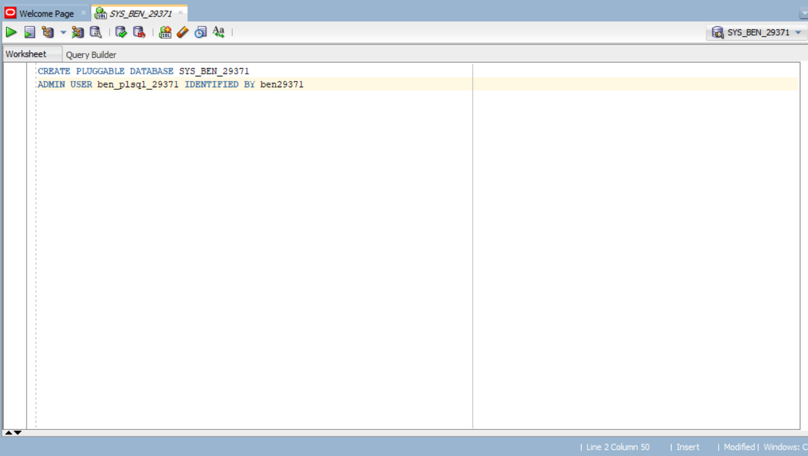
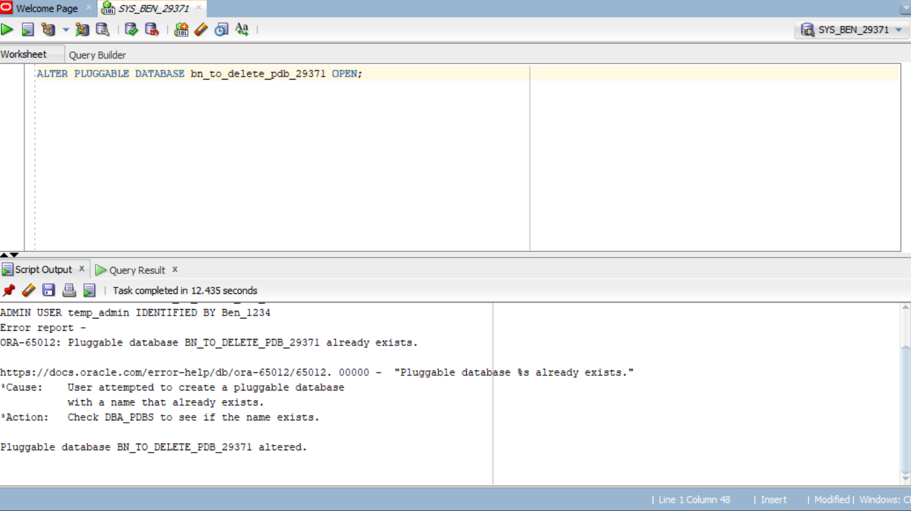
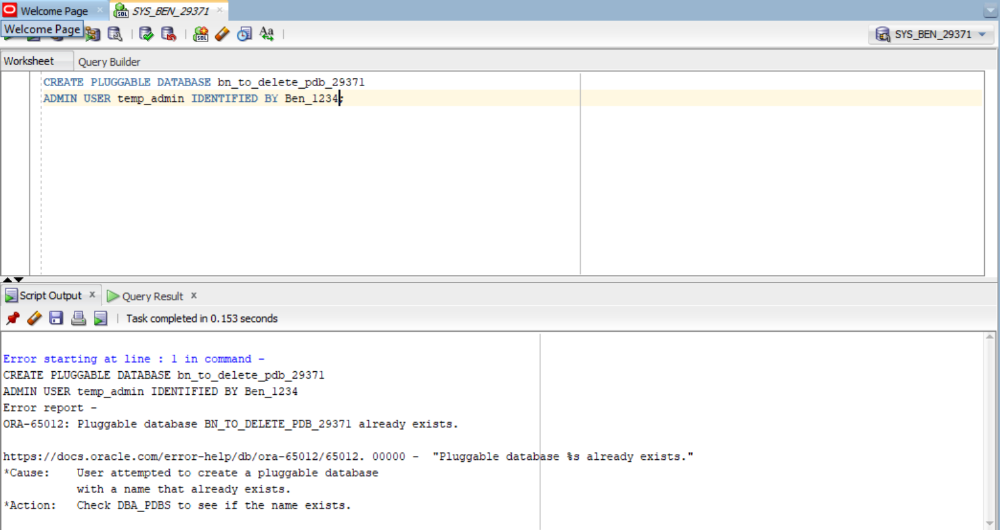
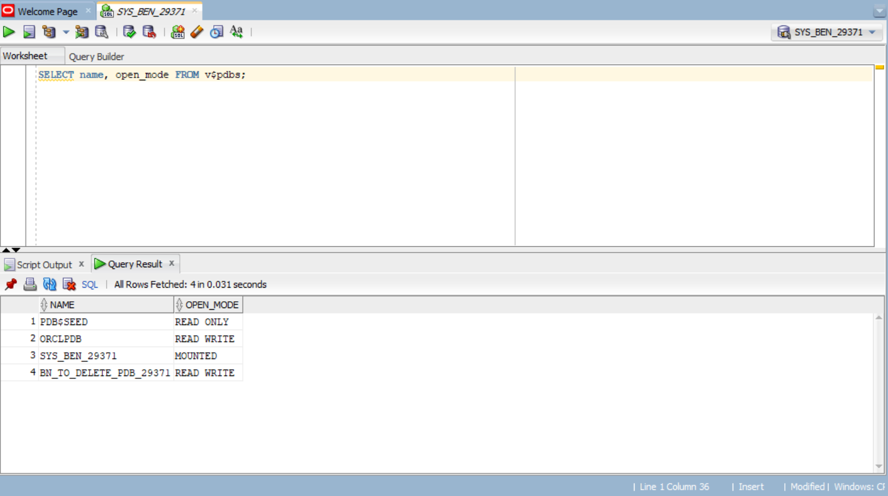
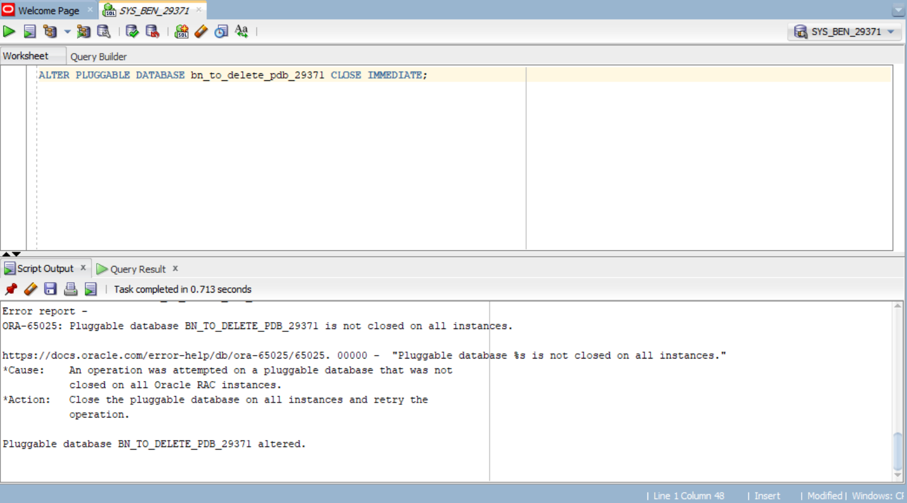
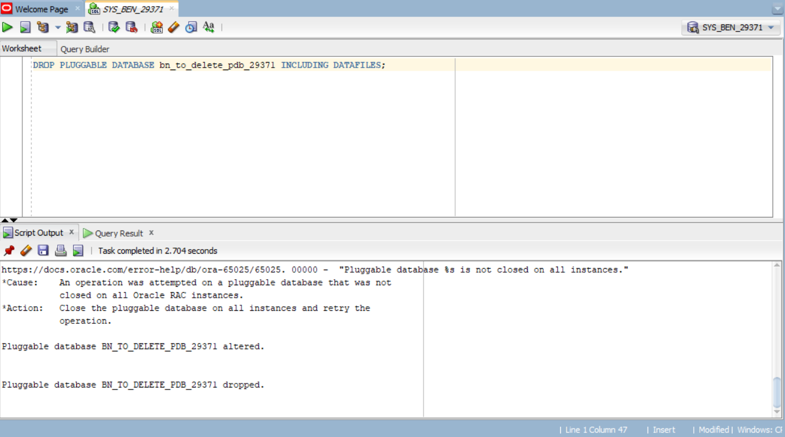

# -oracle_pdb_ass_II_29371_ishimwe_ben_olivier
# Oracle Pluggable Database (PDB) Management
**Assignment II — INSY 8311: Database Development with PL/SQL**

---

## 👤 Student Information

| Field | Details |
|-------|---------|
| **Full Name** | ISHIMWE Ben Olivier |
| **Student ID** | 29371 |
| **Course** | Database Development with PL/SQL (INSY 8311) |
| **Instructor** | Eric Maniraguha |
| **Assignment Date** | February 17, 2026 |
| **Submission Deadline** | February 17, 2026 — 10:00 AM |

---

## 📋 Overview

This repository documents the practical completion of **Individual Assignment II**, focused on Oracle Pluggable Database (PDB) management using Oracle SQL Developer and Oracle Enterprise Manager (OEM).

The assignment covers:
- Creating and managing Pluggable Databases (PDBs) in Oracle Multitenant Architecture
- Creating and deleting a temporary PDB
- Configuring and accessing Oracle Enterprise Manager (OEM)
- Professional documentation of all tasks

---

## 🛠️ Oracle Environment

| Component | Details |
|-----------|---------|
| **Oracle Version** | Oracle Database 21c |
| **Operating System** | Windows 10 |
| **Tool Used** | Oracle SQL Developer |
| **Container Database (CDB)** | ORCL |
| **Oracle Data Path** | `C:\ORACLE21C\ORADATA\ORCL\` |

---

## 📁 Repository Structure

```
oracle_pdb_ass_II_29111_Honore/
│
├── README.md               ← This file
└── screenshots/
    ├── task1_pdb_creation.png
    ├── task1_pdb_open.png
    ├── task1_user_created.png
    ├── task2_temp_pdb_created.png
    ├── task2_temp_pdb_verified.png
    ├── task2_temp_pdb_deleted.png
    ├── task2_temp_pdb_confirmed.png
    └── task3_oem_dashboard.png
```

---

## ✅ Task 1: Create a New Pluggable Database

### Naming Convention Used
- **PDB Name:** `bn_pdb_29371`
- **Username inside PDB:** `ben_plsqlauca_29371`
- **Password:** (kept private)

### What was done
A new Pluggable Database was created from the PDB Seed using Oracle SQL Developer. After creation, the PDB was opened and a dedicated user was created inside it. This user account will be used for all future PL/SQL class work.

### Commands Used

```sql
-- Step 1: Create the PDB
CREATE PLUGGABLE DATABASE ben_pdb_29371
ADMIN USER ben_plsqlauca_29371 IDENTIFIED BY mypassword;

-- Step 2: Open the PDB
ALTER PLUGGABLE DATABASE bn_pdb_29371 OPEN;

-- Step 3: Save state so it opens automatically on restart
ALTER PLUGGABLE DATABASE bn_pdb_29371 SAVE STATE;

-- Step 4: Switch into the PDB
ALTER SESSION SET CONTAINER = bn_pdb_29371;

-- Step 5: Create the user inside the PDB
CREATE USER ben_plsqlauca_29371 IDENTIFIED BY mypassword;

-- Step 6: Grant necessary privileges
GRANT CONNECT, RESOURCE TO ben_plsqlauca_29371;
```

## screenshots
**PDB Creation Command:**



**PDB Open State:**



**User Created:**


### Results
✓ PDB `bn_pdb_29371` successfully created  
✓ PDB opened and configured to auto-start  
✓ User `ben_plsqlauca_29371` created with appropriate privileges

---

## ✅ Task 2: Create and Delete a Temporary PDB

### Naming Convention Used
- **Temporary PDB Name:** `bn_to_delete_pdb_29371`

### What was done
A temporary PDB was created, verified to exist, then completely dropped including all associated data files. Confirmation was done using a query on `v$pdbs` to ensure it no longer existed.

### Commands Used

```sql
-- Step 1: Create the temporary PDB
CREATE PLUGGABLE DATABASE bn_to_delete_pdb_29371
ADMIN USER temp_admin IDENTIFIED BY mypassword;

-- Step 2: Open it to verify it works
ALTER PLUGGABLE DATABASE bn_to_delete_pdb_29371 OPEN;

-- Step 3: Verify it exists
SELECT name, open_mode FROM v$pdbs;

-- Step 4: Go back to CDB root before dropping
ALTER SESSION SET CONTAINER = CDB$ROOT;

-- Step 5: Close the PDB
ALTER PLUGGABLE DATABASE bn_to_delete_pdb_29371 CLOSE IMMEDIATE;

-- Step 6: Drop the PDB and all its files
DROP PLUGGABLE DATABASE bn_to_delete_pdb_29371 INCLUDING DATAFILES;

-- Step 7: Confirm it no longer exists
SELECT name, open_mode FROM v$pdbs;
```


## screenshots
**Temporary db created:**



**DB verification:**




**DB close:**



**Drop Database:**



### Results
✓ Temporary PDB `bn_to_delete_pdb_29371` successfully created  
✓ PDB verified as operational  
✓ PDB successfully dropped with all datafiles removed  
✓ Deletion confirmed via `v$pdbs` query

---

## ✅ Task 3: Oracle Enterprise Manager (OEM)

### What was done
Oracle Enterprise Manager (OEM) was accessed and configured. The dashboard reflects the Oracle 21c environment along with the PDB tasks completed in Tasks 1 and 2.

### Configuration Details
- **OEM Version:** Oracle Enterprise Manager Cloud Control
- **Access URL:** `https://localhost:5500/em`
- **Monitored Database:** ORCL (CDB)
- **Visible PDBs:** `bn_pdb_29371` and other system PDBs

### Results
✓ OEM successfully accessed and configured  
✓ Dashboard displaying CDB and PDB status  
✓ All created PDBs visible in the OEM interface

---

## ⚠️ Challenges Faced & How They Were Solved

### Challenge 1: FILE_NAME_CONVERT Error
**Problem:** When initially trying to create a PDB, the `FILE_NAME_CONVERT` parameter was required but the correct Windows file path was not known.

**Solution:** Ran the following query to find the actual Oracle file paths on the machine:
```sql
SELECT NAME FROM v$datafile;
```
This revealed the correct path: `C:\ORACLE21C\ORADATA\ORCL\`

---

### Challenge 2: OMF (Oracle Managed Files) Not Configured
**Problem:** The parameter `db_create_file_dest` had no value set, meaning Oracle could not automatically manage file destinations. This made PDB creation more complex and required manual file path specification.

**Solution:** Enabled OMF by setting the correct destination path:
```sql
ALTER SYSTEM SET db_create_file_dest = 'C:\ORACLE21C\ORADATA\ORCL' SCOPE=BOTH;
```
After this, PDB creation no longer required `FILE_NAME_CONVERT`.

---

### Challenge 3: Wrong File Path Format (Linux vs Windows)
**Problem:** Documentation and online resources commonly show Linux-style paths (e.g., `/u01/app/oracle/oradata`) which do not work on Windows installations.

**Solution:** Used the `v$datafile` query to identify the correct Windows-style path and adjusted all commands accordingly.

---

## 🔍 Key Concepts Learned

1. **Oracle Multitenant Architecture:** A CDB (Container Database) can host multiple PDBs, each acting as an independent database.

2. **PDB Seed:** The template (`PDB$SEED`) that Oracle uses to create new PDBs.

3. **OMF (Oracle Managed Files):** When enabled, Oracle automatically manages file naming and placement, simplifying PDB creation.

4. **INCLUDING DATAFILES:** Essential when dropping a PDB to ensure physical files are also removed from disk.

5. **PDB State Management:** Using `SAVE STATE` ensures PDBs automatically open on database restart.

6. **Session Container Switching:** The `ALTER SESSION SET CONTAINER` command allows switching between CDB root and specific PDBs.

---

## 🧾 Integrity Statement

I, **ISHIMWE Ben Olivier** (Student ID: **29371**), confirm that all work documented in this repository is my own. All commands were executed personally on my own Oracle 21c installation. No screenshots, commands, or solutions were copied from classmates or any other student.

I understand that violations of academic integrity result in **ZERO MARKS** and I fully accept responsibility for the authenticity of this submission.

---

## 📬 Submission

- **Submitted via:** Google Form (as required)
- **GitHub Repository:** `oracle_pdb_ass_II_29371_ben_Olivier`
- **Repository Visibility:** 🔓 PUBLIC

---

**ISHIMWE Ben Olivier** | Student ID: 29371